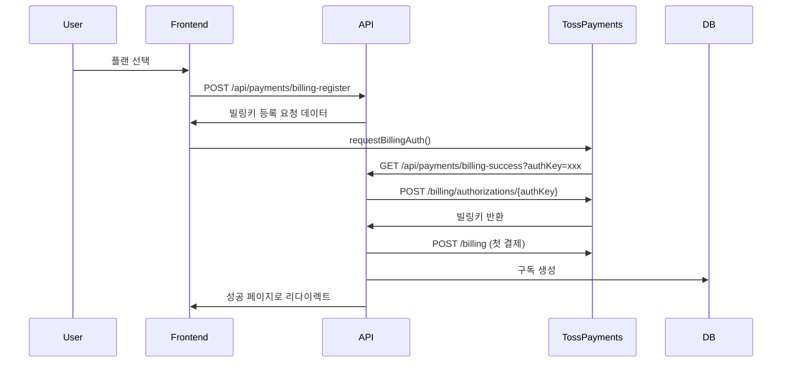
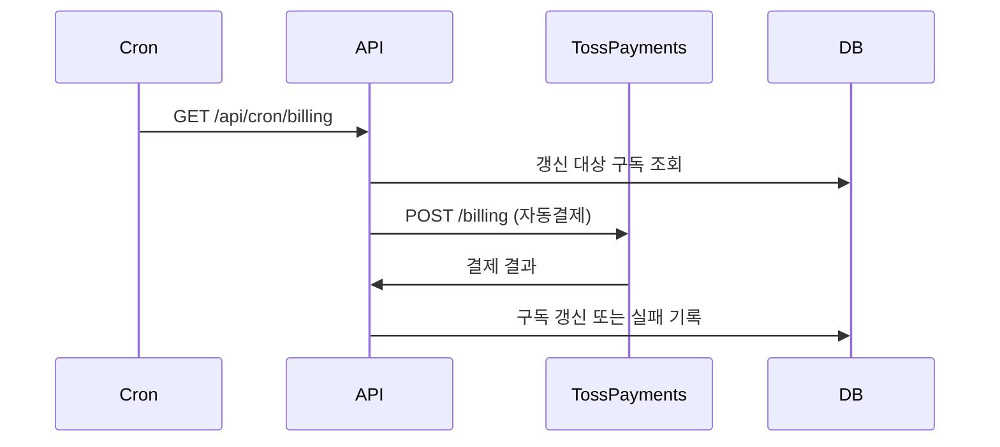

# 토스페이먼츠 구독 결제 시스템

이 문서는 인스타툰 SaaS 플랫폼의 토스페이먼츠 빌링 v2 API 기반 구독 결제 시스템을 설명합니다.

## 시스템 개요

### 구독 플랜
- **개인 플랜**: 월 30,000원 - 6,000토큰(600이미지), 캐릭터 3개
- **헤비유저 플랜**: 월 100,000원 - 25,000토큰(2,500이미지), 캐릭터 5개  
- **기업 플랜**: 월 200,000원 - 60,000토큰(6,000이미지), 캐릭터 무제한

### 핵심 기능
1. 빌링키 기반 정기결제 시스템
2. 자동 구독 갱신 및 토큰 리셋
3. 결제 실패 시 재시도 및 자동 구독 취소
4. 실시간 사용량 추적 및 알림
5. 완벽한 에러 처리 및 사용자 친화적 메시지

## 아키텍처

### 주요 컴포넌트

#### 1. 결제 API 클라이언트 (`/lib/payments/toss-billing-v2.ts`)
- 토스페이먼츠 빌링 v2 API 통합
- 빌링키 발급, 자동결제, 환불 처리
- 에러 처리 및 사용자 친화적 메시지 변환

#### 2. API 엔드포인트
- `/api/payments/billing-register`: 빌링키 등록 요청
- `/api/payments/billing-success`: 빌링키 발급 성공 처리
- `/api/payments/billing-fail`: 빌링키 발급 실패 처리
- `/api/payments/webhook`: 토스페이먼츠 웹훅 처리
- `/api/subscription`: 구독 정보 조회
- `/api/subscription/cancel`: 구독 취소
- `/api/cron/billing`: 자동 결제 크론잡

#### 3. 프론트엔드
- `/dashboard/billing`: 구독 관리 대시보드
- `/dashboard/billing/success`: 결제 성공 페이지
- `/dashboard/billing/error`: 결제 실패 페이지

## 결제 플로우

### 1. 구독 시작


### 2. 정기 결제


## 환경 설정

### 필수 환경 변수
```bash
# Toss Payments
NEXT_PUBLIC_TOSS_CLIENT_KEY=test_ck_xxxxxxxxxxxx
TOSS_SECRET_KEY=test_sk_xxxxxxxxxxxx
TOSS_WEBHOOK_SECRET=your_webhook_secret

# Cron Jobs
CRON_SECRET=your_cron_secret
ADMIN_SECRET=your_admin_secret

# App
NEXT_PUBLIC_APP_URL=http://localhost:3000
```

### Vercel 배포 설정
`vercel.json` 파일에 크론잡 설정:
```json
{
  "crons": [
    {
      "path": "/api/cron/billing",
      "schedule": "0 2 * * *"
    }
  ]
}
```

## 데이터베이스 스키마

### Subscription 테이블
```prisma
model Subscription {
  id                String         @id @default(cuid())
  userId            String         @unique
  
  // 플랜 정보
  plan              SubscriptionPlan @default(FREE)
  tokensTotal       Int            @default(0)
  tokensUsed        Int            @default(0)
  maxCharacters     Int            @default(1)
  maxProjects       Int            @default(3)
  
  // 결제 정보
  tossBillingKey    String?        // 빌링키
  tossCustomerKey   String?        // 고객 고유 키
  
  // 구독 기간
  currentPeriodStart DateTime      @default(now())
  currentPeriodEnd   DateTime
  cancelAtPeriodEnd  Boolean       @default(false)
}
```

### Transaction 테이블
```prisma
model Transaction {
  id                String         @id @default(cuid())
  userId            String
  
  type              TransactionType
  amount            Int            // 원 단위
  tokens            Int?           // 토큰 수량
  
  // 결제 정보
  tossPaymentKey    String?
  tossOrderId       String?
  
  status            TransactionStatus @default(PENDING)
  description       String?
  
  createdAt         DateTime       @default(now())
}
```

## 에러 처리

### 토스페이먼츠 에러 코드 매핑
```typescript
export class TossPaymentsError extends Error {
  getUserFriendlyMessage(): string {
    switch (this.code) {
      case "PAY_PROCESS_CANCELED":
        return "결제가 취소되었습니다.";
      case "REJECT_CARD_COMPANY":
        return "카드사에서 결제를 거부했습니다. 다른 카드를 사용해주세요.";
      case "INVALID_CARD_EXPIRATION":
        return "카드 유효기간이 만료되었습니다.";
      // ... 기타 에러 코드들
    }
  }
}
```

## 모니터링 및 알림

### 1. 결제 실패 모니터링
- 3회 연속 결제 실패 시 자동 구독 취소
- 실패 시 상세 에러 로그 기록
- 사용자에게 친화적 에러 메시지 표시

### 2. 사용량 추적
- 실시간 토큰 사용량 모니터링
- 토큰 부족 시 알림 (5장 미만 생성 가능)
- 일일 생성 한도 체크

### 3. 수익성 분석
```typescript
async getMonthlyProfitAnalysis(userId: string): Promise<{
  revenue: number;      // 월 매출
  actualCost: number;   // 실제 Gemini API 비용
  profit: number;       // 순이익
  margin: number;       // 마진율
  imageCount: number;   // 생성된 이미지 수
}> 
```

## 보안 고려사항

1. **API 키 보안**: Secret Key는 서버에서만 사용, 클라이언트에 노출 금지
2. **웹훅 검증**: HMAC-SHA256 서명 검증으로 위변조 방지
3. **재시도 공격 방지**: 결제 시도 횟수 제한
4. **데이터 암호화**: 민감한 결제 정보는 토스페이먼츠에서 관리

## 테스트 가이드

### 1. 테스트 환경 설정
```bash
# 테스트 키 사용
NEXT_PUBLIC_TOSS_CLIENT_KEY=test_ck_xxxxxxxxxxxx
TOSS_SECRET_KEY=test_sk_xxxxxxxxxxxx
```

### 2. 테스트 카드 번호
- **성공**: 4242424242424242
- **실패**: 4000000000000002
- **인증 필요**: 4000000000003220

### 3. 테스트 시나리오
1. 신규 구독 생성
2. 플랜 변경
3. 구독 취소
4. 결제 실패 처리
5. 자동 갱신

## 프로덕션 배포 체크리스트

- [ ] 실제 토스페이먼츠 API 키 발급 및 설정
- [ ] 웹훅 URL 토스페이먼츠에 등록
- [ ] 도메인 인증서 설정 (HTTPS)
- [ ] 환경 변수 프로덕션 값으로 설정
- [ ] 데이터베이스 마이그레이션 실행
- [ ] 크론잡 스케줄링 확인
- [ ] 모니터링 시스템 연동
- [ ] 에러 알림 설정

## 문제 해결

### 자주 발생하는 문제
1. **빌링키 발급 실패**: 카드 정보 확인, 해외 카드는 지원 안함
2. **자동결제 실패**: 카드 잔액 부족, 카드 만료
3. **웹훅 처리 실패**: 서명 검증 오류, 네트워크 타임아웃

### 디버깅 팁
1. 콘솔 로그에서 상세 에러 메시지 확인
2. 토스페이먼츠 개발자 도구에서 API 호출 기록 확인
3. 데이터베이스에서 트랜잭션 상태 확인

## 라이센스 및 규정 준수

- 토스페이먼츠 이용약관 준수
- 전자상거래법 및 개인정보보호법 준수
- PCI DSS 보안 표준 준수 (토스페이먼츠에서 처리)

---

이 문서는 토스페이먼츠 공식 문서(https://docs.tosspayments.com/guides/v2/billing/integration)를 기반으로 작성되었습니다.