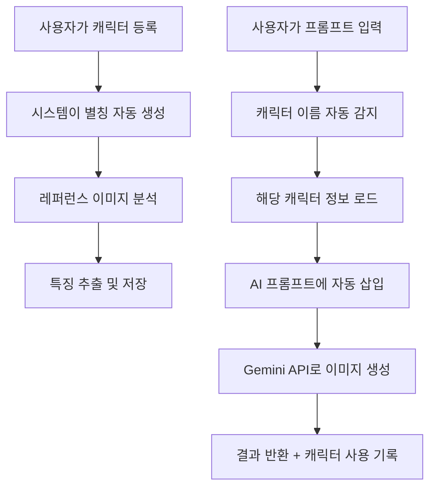

# 🎭 캐릭터 인식 시스템 완벽 가이드

## ✨ 시스템 개요

사용자가 레퍼런스 이미지와 함께 캐릭터를 등록하면, AI가 프롬프트에서 해당 캐릭터를 자동으로 인식하여 레퍼런스 이미지를 참조해 일관된 그림을 생성합니다.

## 🚀 핵심 기능

### 1. 스마트 캐릭터 등록
```typescript
// API 호출 예시
POST /api/characters
{
  "name": "은진",
  "description": "20살 여성, 검은 단발머리, 큰 갈색 눈, 밝은 성격",
  "referenceImages": [
    "https://example.com/eunjin1.jpg",
    "https://example.com/eunjin2.jpg"
  ]
}

// 자동 생성되는 별칭들
Response: {
  "aliases": ["은진", "은진이", "은진아", "은진씨", "은진님", "은진이가", "은진이는", ...]
}
```

### 2. 프롬프트에서 자동 인식
```javascript
// 사용자 입력
프롬프트: "은진이가 카페에서 커피를 마시고 있어"

// 시스템 내부 처리
1. "은진이가" → "은진" 캐릭터로 인식
2. 은진의 레퍼런스 이미지 자동 로드
3. AI 프롬프트에 캐릭터 설명 자동 삽입
```

### 3. AI 프롬프트 자동 향상
```
원본: "은진이가 카페에서 커피를 마시고 있어"

향상된 프롬프트:
[CHARACTER:은진]은진이가[/CHARACTER] 카페에서 커피를 마시고 있어

=== CHARACTER CONSISTENCY ===
[캐릭터: 은진]
=== 외모 특징 ===
- 머리: 검은 단발머리
- 눈: 큰 갈색 눈
- 나이: 20살
- 성별: 여성
- 성격: 밝은 성격

=== 중요 ===
이 캐릭터가 등장할 때마다 위의 특징을 정확히 유지해야 합니다.
```

## 📋 사용 시나리오

### 시나리오 1: 기본 캐릭터 등록
```javascript
// 1단계: 캐릭터 등록
const character = await fetch('/api/characters', {
  method: 'POST',
  body: JSON.stringify({
    name: "민수",
    description: "25살 남성, 갈색 곱슬머리, 안경 착용, 개발자",
    visualFeatures: {
      hairColor: "갈색",
      hairStyle: "곱슬",
      eyeColor: "갈색", 
      age: "25",
      gender: "남성",
      distinctiveFeatures: ["안경"]
    },
    clothing: {
      default: "캐주얼 셔츠",
      variations: ["후드티", "정장"]
    },
    personality: "내향적이지만 친근한 성격",
    referenceImages: [
      "https://cdn.example.com/minsu1.jpg",
      "https://cdn.example.com/minsu2.jpg"
    ]
  })
});

// 자동 생성 별칭: ["민수", "민수야", "민수씨", "민수님", "민수가", "민수는", ...]
```

### 시나리오 2: 웹툰 패널 생성
```javascript
// 사용자가 프롬프트 입력
const prompt = "민수가 컴퓨터 앞에서 코딩하고 있고, 은진이가 옆에서 커피를 가져다 주고 있어";

// API 호출 (캐릭터 자동 인식)
const result = await fetch('/api/ai/generate', {
  method: 'POST',
  body: JSON.stringify({
    prompt: prompt
    // userId는 자동으로 토큰에서 추출
  })
});

// 응답
{
  "success": true,
  "imageUrl": "https://generated-image.jpg",
  "detectedCharacters": ["민수", "은진"],
  "tokensUsed": 1,
  "usage": {
    "generationTimeMs": 3500
  }
}
```

### 시나리오 3: 복합 상황
```javascript
// 여러 캐릭터가 포함된 프롬프트
프롬프트: "은진이와 민수가 학교 운동장에서 농구를 하고 있어. 철수도 함께 있어"

// 시스템 처리 결과:
// ✅ 은진: 등록된 캐릭터 → 레퍼런스 이미지 사용
// ✅ 민수: 등록된 캐릭터 → 레퍼런스 이미지 사용  
// ❌ 철수: 미등록 캐릭터 → 텍스트 설명만으로 생성

detectedCharacters: ["은진", "민수"]
```

## 🔧 고급 기능

### 1. 캐릭터 일관성 검증
```javascript
// 생성된 이미지에서 캐릭터 일관성 체크
const consistency = await characterReferenceManager.checkCharacterConsistency(
  "eunjin-character-id",
  "generated-image-url"
);
// → true/false 반환
```

### 2. 자주 사용하는 캐릭터 조회
```javascript
GET /api/characters?frequent=true

Response: {
  "characters": [
    { "name": "은진", "lastUsed": "2024-01-15", "usageCount": 25 },
    { "name": "민수", "lastUsed": "2024-01-14", "usageCount": 18 }
  ]
}
```

### 3. 배치 생성 (연속 패널)
```javascript
const batchResult = await nanoBananaService.generateBatch([
  { 
    prompt: "은진이가 교실에 들어온다", 
    emotion: "happy" 
  },
  { 
    prompt: "민수가 은진이에게 손을 흔든다",
    emotion: "friendly"
  },
  { 
    prompt: "둘이 함께 대화하고 있다",
    emotion: "warm"
  }
], "slice_of_life");
```

## 🎨 스타일 및 감정 제어

### 스타일 프리셋
```javascript
const styles = {
  korean_webtoon: "기본 한국 웹툰 스타일",
  romance: "로맨스 웹툰 (부드러운 색감, 반짝임 효과)",
  action: "액션 웹툰 (역동적, 속도선)",
  comedy: "개그 웹툰 (과장된 표정, 밝은 색상)",
  slice_of_life: "일상 웹툰 (따뜻한 색감, 현실적 비율)"
};
```

### 감정 표현
```javascript
const emotions = {
  happy: "행복한, 밝은 표정",
  sad: "슬픈, 우울한 분위기",
  angry: "화난, 격양된 상태",
  surprised: "놀란, 충격받은 표정",
  romantic: "로맨틱한, 설레는 분위기",
  nostalgic: "그리운, 향수 어린 감정"
};
```

## 📊 토큰 사용량

### 기본 요금 (2.5배 마진)
- **기본 이미지**: 1토큰 (130원)
- **고해상도**: +0.5토큰 (65원)
- **레퍼런스 사용**: +0.2토큰/장 (26원)

### 계산 예시
```javascript
프롬프트: "은진이가 고해상도로 웃고 있어" (레퍼런스 2장)
토큰 계산:
- 기본 이미지: 1토큰
- 고해상도: +0.5토큰  
- 레퍼런스 2장: +0.4토큰
총 토큰: 2토큰 (260원)
```

## 🔍 디버깅 및 모니터링

### 생성 로그 확인
```javascript
GET /api/ai/generate?path=usage

Response: {
  "balance": {
    "balance": 150,
    "estimatedImagesRemaining": 150
  },
  "history": [
    {
      "date": "2024-01-15T10:30:00Z",
      "tokens": 1,
      "description": "이미지 생성: 1장 (1토큰)",
      "imageCount": 1,
      "cost": 52
    }
  ]
}
```

### 캐릭터 매칭 테스트
```javascript
// 프롬프트에서 캐릭터가 올바르게 감지되는지 테스트
const detection = characterReferenceManager.detectCharactersInPrompt(
  "은진이가 민수와 함께 있어"
);

console.log(detection.detectedCharacters); // [{name: "은진", ...}, {name: "민수", ...}]
console.log(detection.enhancedPrompt);     // "[CHARACTER:은진]은진이가[/CHARACTER]..."
```

## ⚡ 최적화 팁

### 1. 캐릭터 등록 시 주의사항
```javascript
// ✅ 좋은 예
{
  "name": "은진",  // 간단하고 명확한 이름
  "aliases": ["은진이", "김은진"],  // 자주 사용할 호칭
  "description": "20살 여성, 검은 단발머리, 큰 갈색 눈",  // 구체적 특징
  "referenceImages": ["clear-face.jpg", "full-body.jpg"]  // 고품질 이미지
}

// ❌ 나쁜 예
{
  "name": "귀여운 여자아이",  // 모호한 이름
  "description": "예쁜 사람",  // 추상적 설명
  "referenceImages": ["blurry.jpg"]  // 저품질 이미지
}
```

### 2. 프롬프트 작성 요령
```javascript
// ✅ 좋은 예
"은진이가 카페에서 라떼를 마시며 창밖을 바라보고 있어"

// ✅ 더 좋은 예  
"은진이가 아늑한 카페 창가 자리에서 따뜻한 라떼를 마시며 오후 햇살을 받으며 창밖 거리를 바라보고 있어"

// ❌ 나쁜 예
"그 여자가 뭔가 마시고 있어"  // 캐릭터 인식 불가
```

### 3. 성능 최적화
- **레퍼런스 이미지**: 최대 3장까지만 사용 권장
- **배치 생성**: 연속된 패널은 배치로 처리하여 컨텍스트 유지
- **캐시 활용**: 자주 사용하는 캐릭터는 자동으로 캐시됨

## 🎯 실제 사용 플로우



이제 "은진이가 웃고 있어"라고 입력하기만 하면, AI가 자동으로 등록된 은진의 레퍼런스를 참고하여 일관된 모습으로 그림을 그려줍니다! 🎨✨